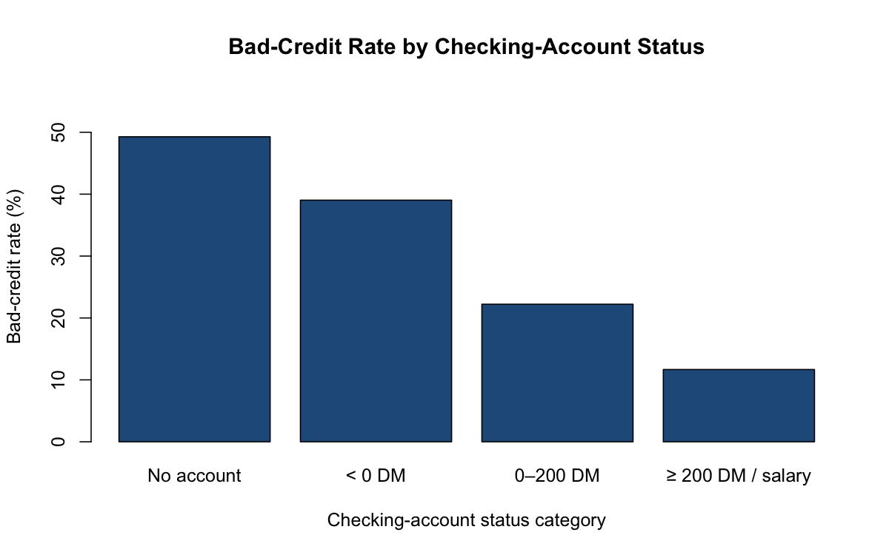
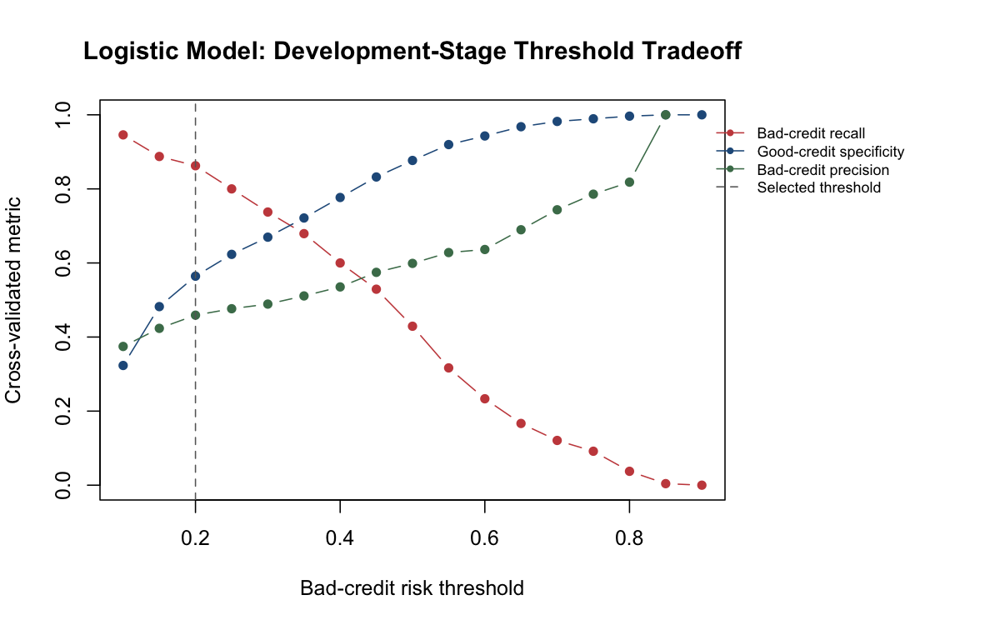
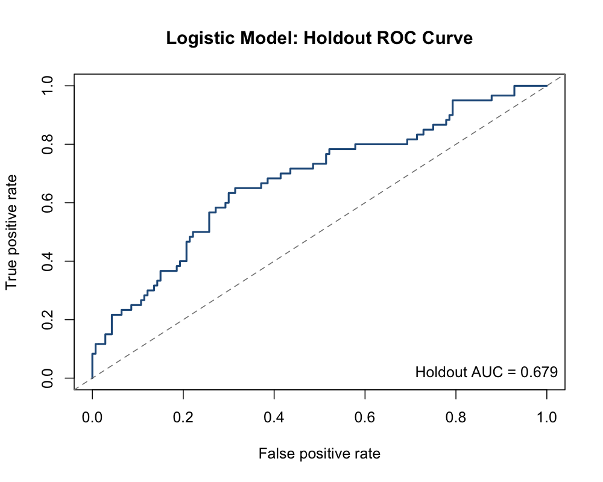

# Credit Risk Modeling: South German Credit Data

## Overview

I analyzed borrower and loan characteristics associated with credit outcomes using the UCI South German Credit data set. The project combines statistical analysis, an interpretable logistic-regression model, development-stage cross-validation, a final holdout evaluation, risk bands, and a random-forest challenger model.

## Credit-risk question

Which borrower and loan attributes are associated with credit outcomes, and how well can an interpretable model rank cases for credit review?

## Data

- **Source:** [UCI Machine Learning Repository — South German Credit](https://archive.ics.uci.edu/dataset/573/south+german+credit+update)
- **Observations:** 1,000
- **Fields:** 21
- **Outcome:** kredit — bad (0) or good (1) credit outcome

The raw data remains local in data/raw/ and is excluded from version control. Download SouthGermanCredit.asc and the codebook from UCI to reproduce the analysis.

## Baseline Full-Sample Analysis

The baseline analysis uses the full data set for exploratory analysis, hypothesis testing, and logistic regression.

- Checking-account status was strongly associated with credit outcome (chi-square = **123.72**; Cramer's V = **0.352**). The observed bad-credit rate declined from 49.3% for borrowers with no checking account to 11.7% for borrowers with at least 200 DM or salary credited for at least one year.
- Credit amount and duration were positively associated (Pearson *r* = **0.625**).
- The baseline full-sample logistic model produced an in-sample AUC of **0.773**, accuracy of **74.7%**, good-credit recall of **89.6%**, and bad-credit recall of **40.0%**.

This version reproduces the core baseline analysis. Additional diagnostic work is outside the scope of this focused credit-risk workflow.

## Validation Design

I used a fixed-seed, stratified 80/20 split (set.seed(555)).

1. **Development sample:** 800 observations.
2. **Model development:** fixed-seed, stratified five-fold cross-validation on the development sample.
3. **Decision rules:** logistic-model threshold, random-forest threshold, and logistic risk-band cutoffs selected from development-stage out-of-fold predictions only.
4. **Final evaluation:** 200-observation holdout sample, untouched until the final model evaluation.

This keeps threshold selection and risk-band design separate from final holdout reporting.

## Final Logistic-Model Holdout Results

The development-stage threshold procedure selected a **20% predicted bad-credit risk** threshold for initial screening. It maximized Youden's J across the cross-validated logistic-model threshold grid, balancing bad-credit recall and good-credit specificity.

| Metric | Final holdout result |
|---|---:|
| ROC/AUC | 0.679 |
| Bad-credit recall | 70.0% |
| Good-credit specificity | 58.6% |
| Bad-credit precision | 42.0% |
| Accuracy | 62.0% |
| False positives | 58 |
| False negatives | 18 |

At this threshold, the model is used to prioritize cases for review, not to make automatic approval or decline decisions. It captures more potentially risky cases than the initial 50% cutoff, while creating a larger review queue.

## Risk Bands

Low, Moderate, and High risk boundaries came from the 33rd and 67th percentiles of development-stage, cross-validated logistic risk predictions. I then applied those fixed cutoffs to the untouched holdout sample.

| Risk band | Holdout observations | Average predicted risk | Observed bad-credit rate |
|---|---:|---:|---:|
| Low | 73 | 7.4% | 17.8% |
| Moderate | 64 | 25.1% | 26.6% |
| High | 63 | 54.2% | 47.6% |

The observed bad-credit rate rises across the three bands, which supports using the logistic model to rank cases by estimated risk.

## Interpretable Risk Drivers

The full-sample logistic model showed the following statistically significant associations with the estimated odds of a good outcome.

| Driver | Odds ratio | p-value | Interpretation |
|---|---:|---:|---|
| Checking status: ≥ 200 DM / salary vs. no account | 6.45 | <0.001 | Higher estimated odds of a good outcome |
| Checking status: 0–200 DM vs. no account | 2.97 | 0.001 | Higher estimated odds of a good outcome |
| Savings: 500–1,000 DM vs. no / unknown | 2.64 | 0.038 | Higher estimated odds of a good outcome |
| Savings: ≥ 1,000 DM vs. no / unknown | 2.15 | 0.001 | Higher estimated odds of a good outcome |
| Employment duration: 4–<7 years vs. unemployed | 2.09 | 0.041 | Higher estimated odds of a good outcome |
| Checking status: < 0 DM vs. no account | 1.63 | 0.010 | Higher estimated odds of a good outcome |
| Loan duration: each additional month | 0.96 | <0.001 | Lower estimated odds of a good outcome |

These results describe model associations rather than causal effects.

## Challenger Model

I used a balanced random forest as a challenger because it can capture nonlinear relationships and interactions. Balanced sampling affects probability calibration, so I selected a separate threshold for each model from its own development-stage cross-validated predictions. Both models were then evaluated once on the same untouched holdout sample.

| Model | Development-selected threshold | Holdout AUC | Bad-credit recall | Good-credit specificity | Bad-credit precision | Accuracy |
|---|---:|---:|---:|---:|---:|---:|
| Logistic regression | 20% | 0.679 | 70.0% | 58.6% | 42.0% | 62.0% |
| Balanced random forest | 55% | 0.692 | 45.0% | 82.1% | 51.9% | 71.0% |

Five-fold development cross-validation produced AUCs of **0.772** for logistic regression and **0.769** for the balanced random forest. The final holdout produced similar AUCs, with the random forest slightly higher. At the development-selected thresholds, logistic regression is better aligned with a broad screening objective because it captures more bad-credit cases. The balanced random forest is more selective, producing fewer false positives but missing more bad-credit cases.

## Files and Outputs

- [Underwriting summary](docs/underwriting-executive-summary.md)
- [Methodology notes](docs/methodology-notes.md)
- [Baseline-analysis and initial-holdout summary](outputs/baseline-analysis-and-initial-holdout-summary.csv)
- [Risk-band results](outputs/validated-risk-band-results.csv)
- [Logistic development threshold analysis](outputs/logistic-development-threshold-analysis.csv)
- [Model threshold selection](outputs/model-threshold-selection.csv)
- [Interpretable risk drivers](outputs/interpretable-risk-drivers.csv)
- [Five-fold cross-validation comparison](outputs/five-fold-cv-model-comparison.csv)
- [Final holdout model comparison](outputs/holdout-model-comparison.csv)

## Repository Structure

~~~text
credit-risk-modeling-south-german-credit/
├── R/
│   ├── 01_credit_risk_analysis.R
│   └── 02_model_enhancements.R
├── data/
│   └── README.md
├── docs/
│   ├── methodology-notes.md
│   └── underwriting-executive-summary.md
├── outputs/
│   ├── figures/
│   └── *.csv
├── README.md
└── .gitignore
~~~

## Tools

- R
- Base R statistics
- pROC
- randomForest

## How to Run

1. Download SouthGermanCredit.asc from the UCI source above.
2. Save it as data/raw/SouthGermanCredit.asc.
3. Install required packages: install.packages(c("pROC", "randomForest")).
4. From the repository root, run R/01_credit_risk_analysis.R.
5. Run R/02_model_enhancements.R.

## Limitations

- The data set is small and uses simplified coded borrower characteristics.
- The 70% good / 30% bad outcome mix makes accuracy insufficient on its own.
- The holdout set provides one final check; larger samples and repeated validation would provide more stable estimates.
- The balanced random forest improves class representation during training but changes probability calibration, which is why it uses its own development-selected threshold.
- The variables are useful screening inputs, not a complete underwriting file.

## Future Improvements

- Add repeated cross-validation or nested cross-validation for more stable performance estimates.
- Assess probability calibration and consider calibration methods for the random forest.
- Test regularized logistic regression and cost-sensitive model selection.
- Add external or time-based validation if a suitable data set becomes available.
